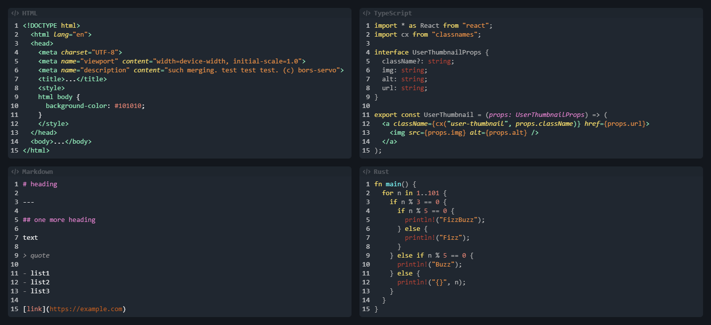

# Discord SynthWave

This is a SynthWave theme for Discord's code blocks, based on [SynthWave '84 for VS Code](https://github.com/robb0wen/synthwave-vscode) by [Robb Owen](https://github.com/robb0wen).

## Installation

For [Bandaged BetterDiscord](https://github.com/rauenzi/BetterDiscordApp) download [this file](/dist/SynthWaveCode.theme.css) (_it should be compatible with the [old BetterDiscord](https://github.com/Jiiks/BetterDiscordApp) too_) and put the file in your themes folder.
You may need to enable "Normalize Classes" in the mod settings (or a similar option that adds stable classes like `.da-channels` to elements).

If you use [EnhancedDiscord](https://github.com/joe27g/EnhancedDiscord), put the contents of [this file](/dist/loader/EnhancedDiscord.css) after another imports in your CSS Loader's style file.

## Preview

> Screenshot from [BandagedBD](https://github.com/rauenzi/BetterDiscordApp) with [Nocturnal](https://betterdiscordlibrary.com/themes/Nocturnal) as main theme
